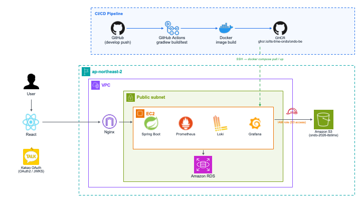

# 온도 (ONDO / Deoham) — Backend

위치 기반 도움 요청 & 실시간 1:1 채팅 서비스 **온도**의 백엔드 서버입니다.
사용자가 주변에 도움을 요청하는 **카드**를 등록하면, 근처 사용자가 이를 확인하고 지원하여 **1:1 채팅**과 **실시간 위치 공유**로 이어집니다.

- **Spring Boot 3.5** / **Java 17** / **Gradle**
- 인증: **Kakao OAuth** → **자체 발급 HS256 JWT** (Spring Security OAuth2 Resource Server)
- 저장소: **PostgreSQL + PostGIS** (Flyway 마이그레이션), **Redis**
- 실시간: **WebSocket / STOMP** 기반 채팅 & 라이브 위치
- 외부 연동: **AWS S3**(이미지), **Firebase FCM**(푸시), **DeepL**(메시지 번역)

---

## 🗺️ 서버 구조도

<!--
  여기에 서버 구조도를 추가하세요.
  예) 이미지: 
      또는 mermaid 다이어그램 블록
-->

<!-- ARCHITECTURE_DIAGRAM_START -->


<!-- ARCHITECTURE_DIAGRAM_END -->

---

## ✨ 주요 기능

| 도메인 | 설명 | 주요 엔드포인트 |
| --- | --- | --- |
| **Auth** | Kakao OAuth 로그인, 자체 JWT 발급/재발급/로그아웃 | `/api/auth/kakao`, `/api/auth/refresh`, `/api/auth/logout` |
| **User** | 프로필 조회/등록/수정/탈퇴 (프로필 이미지 S3 업로드, 소프트 삭제) | `/api/user/profile` |
| **Card** | 도움 요청 카드 생성, 위치 기반(PostGIS) 주변 카드 조회, 지원(apply), 취소/완료/재시도 | `/api/cards`, `/api/cards/nearby`, `/api/cards/{id}/applies` |
| **Chat** | 카드 기반 1:1 채팅방, 메시지 송수신(REST + STOMP), 읽음 처리, 방 종료 | `/api/chat/rooms/**`, STOMP `/chat/rooms/{roomId}/messages` |
| **Live Location** | 채팅방 내 실시간 위치 공유 (STOMP) | STOMP `/chat/rooms/{roomId}/live-location` |
| **Translation** | 채팅 메시지 번역 (DeepL 기본, 실패 시 Gemini 자동 failover) | `/api/chat/messages/{id}/translations` |
| **Notification** | 인앱 알림 조회/읽음 처리, FCM 토큰 관리 및 푸시 발송 | `/api/notifications/**` |
| **Report** | 사용자 / 채팅방 신고 | `/api/reports`, `/api/reports/chat-rooms/{roomId}` |

---

## 🧱 기술 스택

| 분류 | 기술 |
| --- | --- |
| Language / Framework | Java 17, Spring Boot 3.5.14 |
| 인증/보안 | Spring Security 6, OAuth2 Resource Server (self-issued HS256 JWT) |
| 데이터베이스 | PostgreSQL + PostGIS, Flyway, Hibernate Spatial |
| 캐시 | Redis |
| 실시간 | Spring WebSocket / STOMP |
| 파일 저장 | AWS SDK v2 (S3 + STS, presigned URL) |
| 푸시 알림 | Firebase Admin SDK (FCM) |
| 번역 | DeepL API (기본) + Google Gemini (자동 failover) |
| API 문서 | SpringDoc OpenAPI 2.8.x (Swagger UI) |
| 관측성 | Micrometer + Prometheus, Loki (logback appender), Grafana |
| 테스트 | JUnit 5, Testcontainers (Postgres + Redis), Spring Security Test |
| 인프라 | Docker, Nginx, Let's Encrypt(certbot), GitHub Actions, AWS EC2, GHCR |

---

## ✅ 사전 요구사항

- **JDK 17** (Temurin 권장)
- **Docker** / **Docker Compose** (로컬 Postgres·Redis·LocalStack, 테스트의 Testcontainers)

---

## 🚀 로컬 실행

로컬 개발은 `compose-local.yaml`로 앱 + Postgres(PostGIS) + Redis + LocalStack(S3) + 모니터링 스택을 함께 띄웁니다.

```bash
cp .env.example .env      # 실제 값 채우기 (아래 "설정" 참고)
docker compose -f compose-local.yaml up --build
```

- API: <http://localhost:8080>
- Swagger UI: <http://localhost:8080/swagger-ui.html>
- Health: <http://localhost:8080/actuator/health>

> `application-local.yml`의 datasource/redis 호스트는 compose 네트워크 이름(`postgres`, `redis`)을 사용하므로,
> 앱을 compose 안에서 실행하는 것이 기본 흐름입니다.
> 호스트에서 `./gradlew bootRun`으로 직접 띄우려면 datasource/redis 호스트를 `localhost`로 오버라이드하세요.
> (`bootRun`은 `build.gradle` 설정에 따라 `.env`를 자동으로 읽어 환경 변수로 주입합니다.)

---

## ⚙️ 설정

프로파일은 `spring.profiles.active`로 결정되며 기본값은 `local`입니다.

- `application.yml` — 공통 기본값 (포트, JPA, Swagger, JWT/CORS/S3/외부 키 플레이스홀더)
- `application-local.yml` — 로컬 compose 네트워크 대상, verbose 로깅
- `application-test.yml` — 테스트 프로파일 (Testcontainers)
- `application-prod.yml` — 전부 환경 변수 기반

비밀 값(Kakao·Gemini·DeepL 키 등)은 yml에 두지 않고 **gitignore된 `.env`** 파일에서 로드합니다.
`docker compose`(`compose.yaml`·`compose-local.yaml`)는 `env_file`로, `./gradlew bootRun`은 `build.gradle` 로직으로 동일한 `.env`를 참조합니다.

### 로컬 필수 환경 변수 (`.env`)

값이 없으면 앱이 기동하지 않는 항목:

| 변수 | 설명 |
| --- | --- |
| `KAKAO_REST_API_KEY` | Kakao OAuth REST API 키 |
| `KAKAO_CLIENT_SECRET` | Kakao OAuth Client Secret |
| `DEEPL_API_KEY` | DeepL API 키 (기본 번역 프로바이더) |
| `GEMINI_API_KEY` | Gemini API 키 (DeepL 실패 시 자동 failover 프로바이더, https://aistudio.google.com/apikey) |

그 외 항목(`JWT_SECRET`, `AWS_S3_*`, `KAKAO_REDIRECT_URI`, `GEMINI_MODEL`, `KAKAO_MAP_REST_API_KEY` 등)은 생략 시 `application-local.yml`의 기본값을 사용합니다. 자세한 내용은 `.env.example` 참고.

> ⚠️ `JWT_SECRET`은 **최소 32자(256비트)** 여야 합니다. NimbusJwtDecoder(HmacSHA256) 제약.

### 프로덕션 환경 변수

프로덕션 필수 환경 변수 목록은 [`CLAUDE.md`](./CLAUDE.md)의 *Required env vars (prod)* 섹션을 참고하세요.

---

## 🔐 인증 흐름

1. 프론트엔드가 `/api/auth/kakao`로 Kakao 소셜 로그인 시작
2. 백엔드가 Kakao OAuth 콜백(`/api/auth/kakao/callback`)을 처리하고 사용자 레코드 생성/갱신
3. 백엔드가 `JWT_SECRET`으로 서명한 자체 HS256 JWT(access/refresh) 발급
4. 프론트엔드가 모든 요청에 `Authorization: Bearer <jwt>` 헤더로 전송
5. Spring OAuth2 Resource Server가 서명·만료 검증 (`SecurityConfig.jwtDecoder`)
6. `AppJwtAuthenticationConverter`가 `role` 클레임을 `ROLE_<role>` 권한으로 매핑하고 `sub`(UUID)를 principal로 설정
7. 서비스 코드는 `AuthenticationUtils.currentPrincipal()`로 타입 지정된 `AuthPrincipal(userId, email, role)` 획득

---

## 🏗️ 빌드

```bash
./gradlew clean build         # 전체 빌드 + 테스트 (Testcontainers용 Docker 필요)
./gradlew bootJar -x test     # 부팅 JAR 만 생성 (테스트 스킵)
docker build -t deoham-be .   # 컨테이너 이미지 (멀티스테이지 Dockerfile)
```

### 테스트

```bash
./gradlew test                                            # 전체 테스트
./gradlew test --tests com.deoham.DeohamApplicationTests  # 단일 클래스
./gradlew test --tests 'com.deoham.SomeTest.someMethod'   # 단일 메서드
```

> 일부 WebSocket/위치 통합 테스트는 `build.gradle`에서 제외되어 있습니다
> (`ChatRoomLocationTest`, `ChatWebSocketIntegrationTest`, `LiveLocationWebSocketIntegrationTest`).

---

## 📁 프로젝트 구조

```
com.deoham
├── DeohamApplication
├── global
│   ├── config         # SecurityConfig, RedisConfig, OpenApiConfig, S3Config, WebSocketConfig 등
│   ├── security       # JwtProperties, AppJwtAuthenticationConverter, AuthPrincipal,
│   │                  # AuthenticationUtils, StompAuthChannelInterceptor 등
│   ├── exception      # ErrorCode, BusinessException, GlobalExceptionHandler
│   └── response       # ApiResponse<T>
├── auth               # Kakao OAuth 로그인 & JWT 발급
├── user               # 프로필
├── card               # 도움 요청 카드 + 지원(apply)
├── chat               # 1:1 채팅, 라이브 위치, 번역 (REST + STOMP)
├── notification       # 인앱 알림 + FCM 푸시
├── notice             # 공지
├── report             # 신고
└── push               # 푸시 로그
```

도메인 코드는 `com.deoham.<feature>` 아래에 controller · service · repository · entity를 기능 단위로 둡니다(레이어 단위 아님).

### 응답 규격 (`ApiResponse<T>`)

- 성공: `{ "success": true, "data": ..., "error": null }`
- 실패: `{ "success": false, "data": null, "error": { "code": "...", "message": "..." } }`

필터 단계 인증 실패는 `@RestControllerAdvice`가 아닌 `RestAuthenticationEntryPoint` / `RestAccessDeniedHandler`를 거치며, 동일한 `ApiResponse` 형태를 유지합니다.

---

## 🗄️ 데이터베이스 & 마이그레이션

- 스키마는 **Flyway**가 소유합니다. `spring.jpa.hibernate.ddl-auto=validate` — Hibernate는 DB를 변경하지 않습니다.
- 마이그레이션 위치: `src/main/resources/db/migration/V<N>__<description>.sql`
- PostGIS 확장을 사용하며(위치 기반 카드 조회), SRID 초기화 마이그레이션 포함.

---

## 📖 API 문서

- Swagger UI: <http://localhost:8080/swagger-ui.html>
- OpenAPI JSON: <http://localhost:8080/v3/api-docs>

각 컨트롤러는 `*ControllerDocs` 인터페이스로 문서 애노테이션을 분리해 관리합니다.

---

## 📈 모니터링 & 관측성

- **Actuator**: `/actuator/health`, `/actuator/info`, `/actuator/prometheus`
- **Prometheus** + **Micrometer**: 메트릭 수집
- **Loki**(logback appender) + **Grafana**: 로그 집계 및 대시보드
- 로컬/프로덕션 compose에 monitoring 스택(prometheus, alertmanager, loki, grafana) 포함

---

## 🔄 CI/CD & 배포

`.github/workflows/ci.yml` (GitHub Actions):

1. **build** — `develop`/`main` push 및 PR에서 `./gradlew clean build` (Testcontainers 포함)
2. **image** — `develop` push 시 러너에서 이미지를 빌드해 **GHCR**(`ghcr.io/its-time-ondo/ondo-be`)에 push
   (EC2 대신 러너에서 빌드하여 t3.micro 메모리 스파이크 방지)
3. **deploy** — `develop` push 시 SSH로 **AWS EC2**에 접속, `compose.yaml`로 GHCR 이미지를 pull & 기동
   - Nginx 리버스 프록시 + **Let's Encrypt(certbot)** 인증서 자동 발급/갱신
   - t3.micro OOM 방지를 위한 swap 보장, DB/Redis/헬스체크 검증

---

## 📌 주의사항 (Things that bite)

- **필터 단계 인증 실패는 `@RestControllerAdvice`를 타지 않습니다** — `AuthenticationEntryPoint` / `AccessDeniedHandler`로 처리되며, 동일한 `ApiResponse` 형태를 유지해야 합니다.
- **`open-in-view: false`** 설정 — `@Transactional` 밖의 lazy 연관관계 접근은 예외가 발생합니다. 트랜잭션 경계를 명확히 하세요.
- **`JWT_SECRET`은 ≥ 32자** — HmacSHA256(256비트) 최소 키 길이 요구.

아키텍처·패키지 레이아웃·프로덕션 연결 정보 등 상세는 [`CLAUDE.md`](./CLAUDE.md)를 참고하세요.